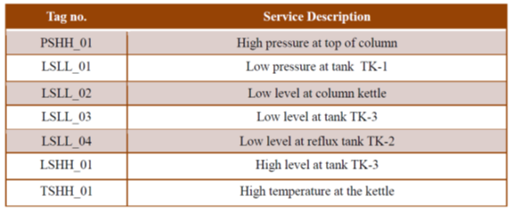
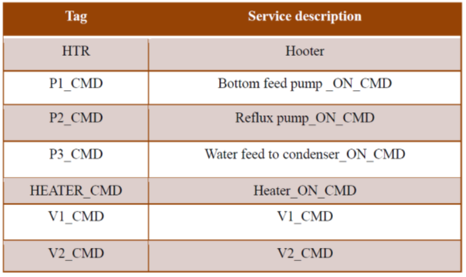
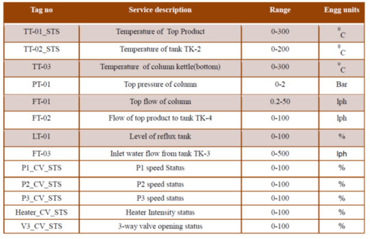
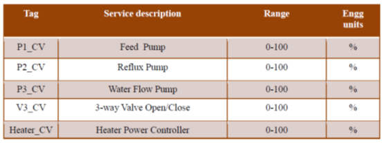
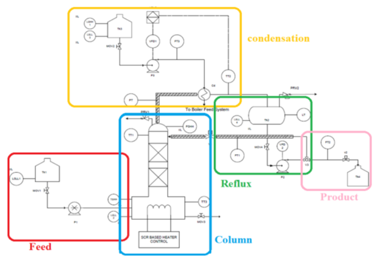

## Theory

The distillation column pilot plant is a crucial tool for process development, optimization, and scale-up in the chemical, petrochemical, and pharmaceutical industries. By replicating real-world industrial conditions on a smaller scale, this pilot plant enables the testing and refinement of distillation processes, identification of optimal operating conditions, and evaluation of new separation technologies. The plant’s advanced instrumentation system, featuring cutting-edge sensors, analyzers, and control systems, provides real-time monitoring and control of key process parameters such as temperature, pressure, flow rates, and composition.

This allows for precise data collection, reduced experimentation time, and improved process understanding, ultimately leading to enhanced product quality, increased yields, and reduced energy consumption. Furthermore, the pilot plant's automated operation and data acquisition capabilities facilitate the development of predictive models, enable the training of operators and engineers, and support the implementation of advanced process control strategies, thereby bridging the gap between laboratory-scale experiments and commercial-scale production.

Process industries add value to materials by mixing, separating, forming or chemical reactions. Processes may be either continuous or batch and usually require rigid process control and high capital investment. The developments in automation, and the resulting complexity of the systems involved, have made the reliability of the machines even more important. This is especially true in the process industry, characterized by expensive specialized equipment and stringent environmental considerations; therefore, the need for a good process design and control system is obvious. A pilot plant is a small industrial system which is operated to generate information about the behavior of the system for use in design of larger facilities. Pilot plants are used to reduce the risk associated with construction of large process plants. They do this in two ways, they are substantially less expensive to build than full-scale plants and they provide valuable data for design of the full-scale plant. Distillation is a very old technique used for separation. Thermodynamics is the driving principle for distillation and by adding and removing heat, separation of liquids is obtained. Before industrialization, distillation was a batch process used for making beverages and alcohol. 

### TYPES OF DISTILLATION COLUMN: 

#### I. Based on the number of products extracted, distillation columns can be classified into two types:

#### a.	Binary distillation column: 

There is a mixture of two components which are to be separated and at the end of distillation we obtain two individual components.
 
#### b. Multi component distillation column: 

The feed contains more than two components which are to be distilled.

#### II. Based on the type of column, distillation columns can be classified into two types:

#### a. Batch distillation column: 

The feed to the column is introduced batch wise. At first the distillation column is charged with feed in a specific lot or batch and after that distillation process is carried out. After that the specific batch is obtained and another batch is introduced. 

#### b. Continuous Distillation Column: 

The feed to the column is charged continuously and the product is extracted continuously. Continuous columns process a continuous feed stream. 

#### III. Based on the type of column internals, distillation columns can be classified into two types: 

#### a. Tray Columns: 

Trays of various designs are used to hold up the liquid to provide better contact between vapor and liquid. 

#### b. Packed Columns: 

Internal packing is used for enhancing the contact between the vapor and liquid.
Various I/Os for the pilot distillation column.

Function of important components
The instrumentation components in Distillation plant can be divided into the following groups:

#### Sensors and transmitters:

The transducer measures a process variable while the transmitter transmits the data to the controller as a 4-20 mA current signal. The following transducer + transmitter units have been included in the plant for measurement and transmission of process variable data (parenthesis contains the tag no. of the instrument):

1. Temp Sensor (RTD PT-100) + Transmitter (TT1): For packed column top temperature measurement
2. Temp Sensor (RTD PT-100) + Transmitter (TT2): For reflux tank temperature measurement
3. Temp Sensor (RTD PT-100) + Transmitter (TT3): For packed column Bottom temperature measurement
4. Pressure Transmitter (PT): For Packed Column Pressure measurement
5. Level Transmitter (LT): For Reux Tank measurement
6. Flow Transmitter (FT-01) :- For feed Flow measurement from Reflux tank to top of column
7. Flow Transmitter (FT-02) :- For product Flow measurement to distillate tank
8. Flow Transmitter (FT-03) :- For cooling water flow Measurement to condenser

#### Final control elements:

The final control element adjusts the amount of energy/mass that goes into or out from process as commanded by the controller. The following are the final control elements used in the plant:

1. Peristaltic pump for feed and Product: The speed of the motor and in turn feed flow is changed using manual insertion of Output.
2. Electric heater for heating: The temperature is controlled using SCR.
3. Centrifugal Pump: The speed is controlled by a VFD and hence flow rate.

#### Safety components:

These components ensure process safety which generally refers to the prevention of unintentional releases of chemicals, energy, or other potentially dangerous materials (including hot air) during the course of process that can have a serious effect to the plant and environment. Process safety involves, for example, the prevention of leaks, spills, equipment malfunction, over-pressures, over-temperatures, corrosion, metal fatigue and other similar conditions. Following instruments are included to keep process variables under safe limit as well as provide alarms interlocks to automatically take necessary action:

1. Pressure switches to take care of the Safety in the packed column
2. Temperature switch at column for safety
3. Low level switches:
These switches are installed for the feed tank, Kettle, Reflux tank cold water tank. This switch shuts off the process if there is no feed to the column. Also, it will avoid dry running of pump if there is nothing to pump in the tank.

